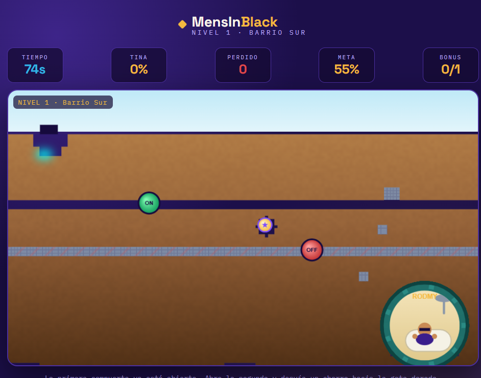

# MensInBlack

## 📝 Descripción
**MensInBlack** es un ingenioso juego de puzles y lógica inspirado en la dinámica de fluidos de títulos clásicos como *Where's My Water?*. 
* **Objetivo:** Guiar y canalizar el flujo de agua a través de un sistema de tuberías o caminos subterráneos para alcanzar el destino correcto antes de que se agote el recurso.
* **Mecánica principal:** Manipulación del entorno y resolución espacial para desviar, limpiar y dirigir el caudal de líquido evitando obstáculos.

## 🎮 Género
* Puzzle / Física / Estrategia

## ⌨️ Controles
* **CLICK / MOUSE:** Interactuar con el entorno, cavar caminos o mover piezas de tubería.
* **ARRASTRAR (Drag):** Modificar el flujo o trazar trayectorias en pantalla.
* **ESC:** Pausa.

## 📸 Capturas de pantalla

## 🛠️ Tecnologías utilizadas
* HTML5 Canvas, CSS3 y JavaScript moderno.
* Algoritmos de simulación de gravedad y lógica de fluidos basados en vectores.
* Asistencia de IA para la optimización de la detección de colisiones del líquido con los elementos del escenario.

## 🚀 ¿Qué aprendimos?
Implementar lógica de partículas y simular el comportamiento físico de líquidos en un entorno web utilizando JavaScript y manipulación de matrices de celdas.

## 🔧 Mejoras a futuro
Incorporar diferentes tipos de líquidos (ácidos o congelados), efectos de sonido dinámicos para el flujo de agua y un sistema de tuberías especiales con válvulas interactivas.
