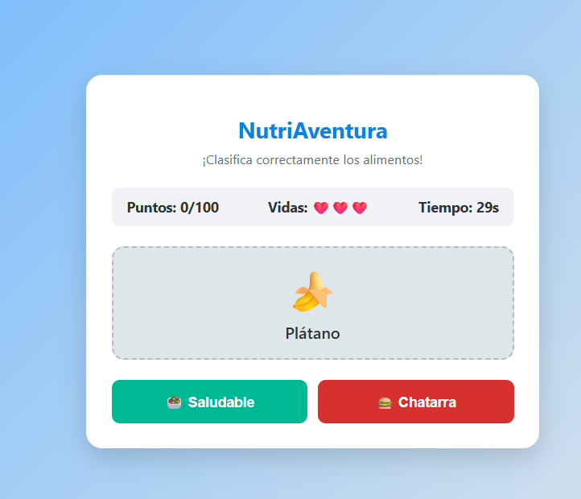

# NutriAventura

## 📝 Descripción
**NutriAventura** es un juego interactivo de carácter educativo enfocado en la agilidad mental y la toma de decisiones rápidas sobre la alimentación.
* **Objetivo:** Clasificar correctamente los distintos tipos de alimentos que aparecen en pantalla en sus respectivas categorías (saludables vs. comida chatarra) antes de que finalice el tiempo.
* **Mecánica principal:** Mecánica de arrastre (drag-and-drop) o selección rápida para evaluar y ordenar elementos nutricionales de manera eficiente.

## 🎮 Género
* Puzzle / Educativo / Casual

## ⌨️ Controles
* **CLICK / MOUSE:** Seleccionar, arrastrar o pulsar sobre los alimentos para colocarlos en la categoría correspondiente.
* **ESC:** Pausa.

## 📸 Capturas de pantalla

## 🛠️ Tecnologías utilizadas
* HTML5, CSS3 y JavaScript moderno para la manipulación del DOM y eventos de interacción.
* Sistema de lógica condicional para el puntaje y validación de categorías.
* Diseño UI optimizado con herramientas de apoyo de IA.

## 🚀 ¿Qué aprendimos?
Manejar eventos dinámicos del mouse y lógica de colisiones o zonas de entrega (*drop zones*) en JavaScript puro para validar respuestas en tiempo real.

## 🔧 Mejoras a futuro
Incorporar una barra de vidas o tiempo dinámico, niveles con mayor velocidad de aparición de elementos y un sistema de estadísticas nutricionales al finalizar la partida.
