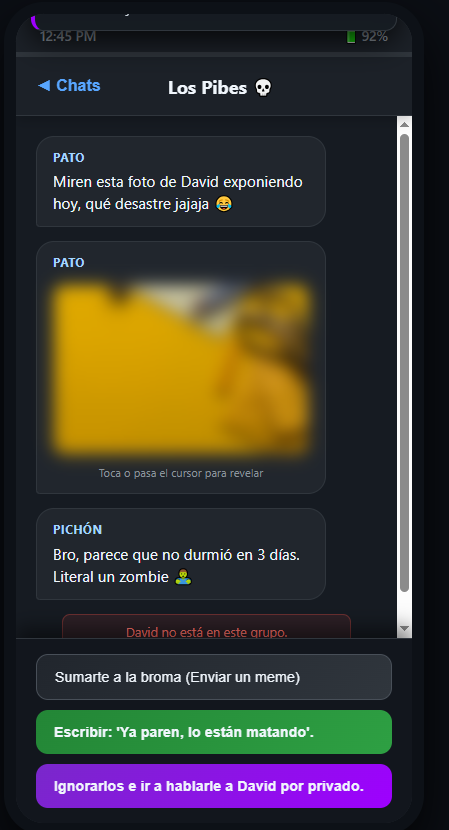

# Storytelling

## 📝 Descripción
**Storytelling** es un prototipo interactivo enfocado en la narrativa visual, donde las decisiones del jugador moldean el transcurso de la historia.
* **Objetivo:** Avanzar a través de la trama descubriendo los distintos desenlaces posibles.
* **Mecánica principal:** Lectura interactiva y selección de diálogos o acciones en momentos clave.

## 🎮 Género
* Adventure / Visual Novel

## ⌨️ Controles
* **CLICK / MOUSE:** Avanzar diálogos y seleccionar decisiones.
* **ESPACIO:** Continuar texto.

## 📸 Capturas de pantalla

## 🛠️ Tecnologías utilizadas
* HTML5, CSS3 y JavaScript.
* Lógica modular para la gestión de eventos de texto.

## 🚀 ¿Qué aprendimos?
La importancia de una buena maquetación CSS para conseguir una interfaz limpia, legible y atractiva tipo novela visual.

## 🔧 Mejoras a futuro
Incorporar música de fondo dinámica según la tensión de la escena y efectos de transición visuales.
