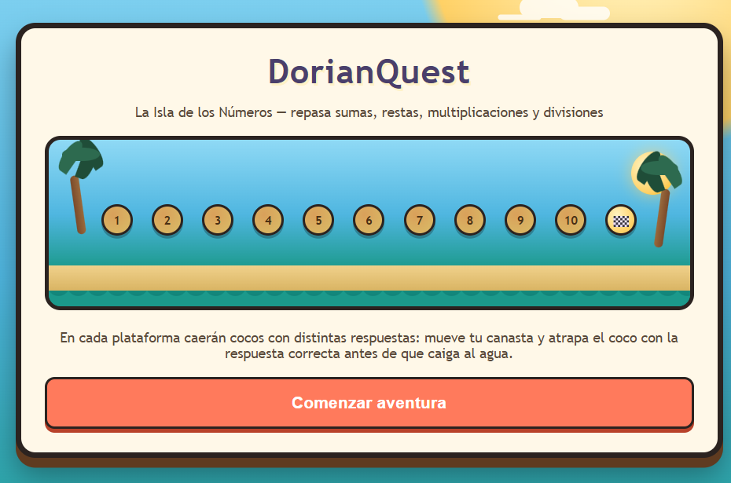

# Dorian Quest

## 📝 Descripción
**Dorian Quest** es un juego de exploración y aventura donde el protagonista debe superar obstáculos y resolver desafíos en un entorno misterioso.
* **Objetivo:** Completar la mazmorra o nivel recolectando los ítems necesarios para alcanzar la meta.
* **Mecánica principal:** Movimiento de plataformas y resolución de pequeños acertijos lógicos.

## 🎮 Género
* Platformer / Aventura

## ⌨️ Controles
* **WASD / Flechas:** Movimiento y desplazamiento.
* **SPACE:** Saltar.
* **ESC:** Pausa.

## 📸 Capturas de pantalla

## 🛠️ Tecnologías utilizadas
* HTML5 Canvas y JavaScript para la física básica de movimiento.
* Soporte de IA para depuración de código en el sistema de coordenadas.

## 🚀 ¿Qué aprendimos?
Manejar la física de gravedad simulada y las colisiones básicas con los bordes del escenario.

## 🔧 Mejoras a futuro
Añadir enemigos patrullando, sistema de vidas y múltiples niveles con dificultad incremental.
